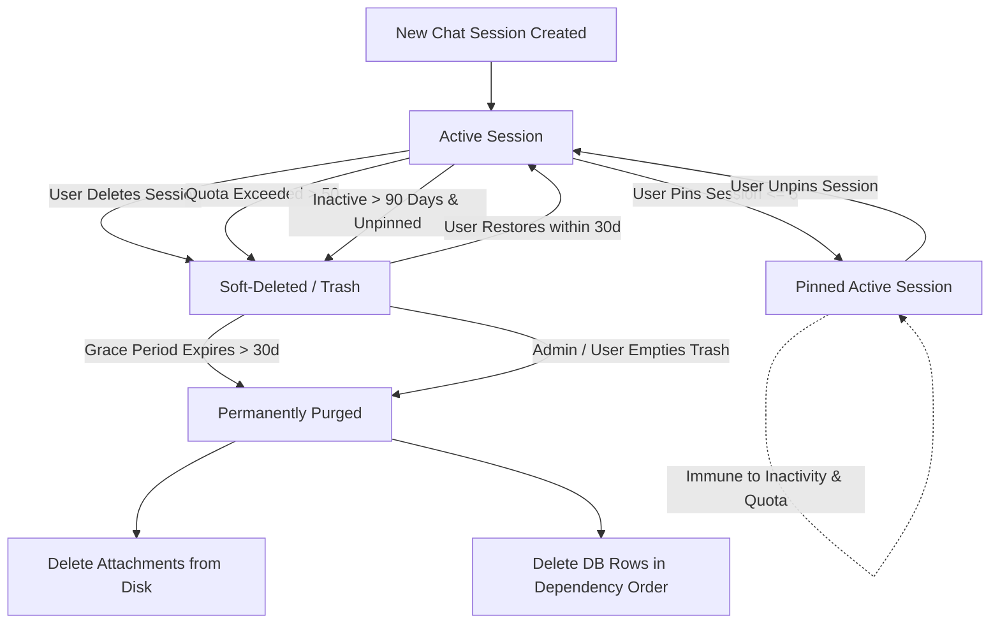
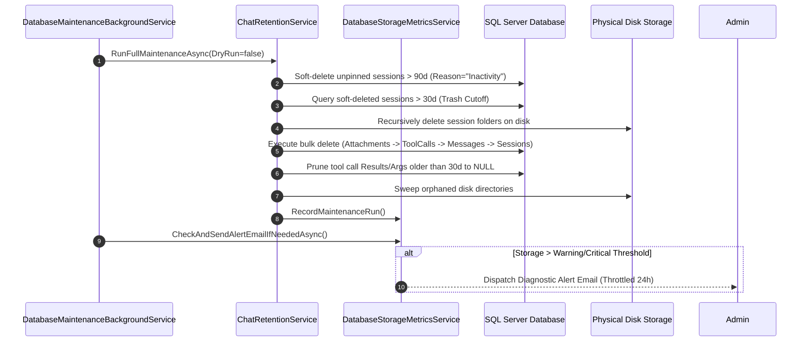

# Chat Message & Data Retention Architecture

This document specifies the architecture, data structures, state machine, business rules, and background maintenance engine for chat session and message retention in Overseer. Human developers and AI agents must use this specification to verify and maintain business logic across the backend and frontend.

---

## 1. Architectural Overview & Context

Overseer shares a Microsoft SQL Server database instance with GnollHack game logs and telemetry. SQL Server Express enforces a physical per-database storage cap on data files, and **the cap depends on the product version** — 10 GB on 2008 R2 through 2022, 50 GB from 2025 onward, and none at all on Standard, Developer, Enterprise, or Azure SQL.

**Never hard-code the cap.** `DatabaseStorageMetricsService` detects the edition and version at runtime via `SERVERPROPERTY` (cached for one hour), and the pure `SqlServerCapacity` resolver in `Overseer/Models/SqlServerCapacity.cs` maps that onto the ceiling, a `HasEngineSizeLimit` flag, a display label, and a `LimitSource` of `Detected`, `Configured`, or `Fallback`. `DatabaseMaxSizeMbOverride` forces a ceiling when one is needed. The production instance is currently SQL Server 2022 Express, so the effective cap is 10 GB — but that is an observation, not an invariant to code against.

The cap applies to the **sum** of the database's data files (`sys.database_files WHERE type = 0`), excluding the transaction log, FILESTREAM containers, and full-text files.

Because LLM chat sessions accumulate extensive text transcripts, large tool call execution payloads, and disk attachments, Overseer implements a **multi-tiered automated retention strategy** across two storage mediums:
1. **Relational Database (`ApplicationDbContext`)**: Stores session metadata, messages, token metrics, and tool execution payloads.
2. **Disk Storage (`ConversationsDataLocation`)**: Stores uploaded images and file attachments in session-keyed folders (`<baseDir>/<sessionId>/`).

---

## 2. Session Lifecycle & State Machine

Every `ChatSession` exists in one of three states: **Active**, **Soft-Deleted (Trash)**, or **Permanently Purged**.

### State Matrix

| State | DB Properties | UI Visibility | Retention & Maintenance Behavior |
|---|---|---|---|
| **Active (Unpinned)** | `IsDeleted = false`, `IsPinned = false` | Sidebar chat history | - Counts toward user active quota (`MaxActiveSessionsPerUser = 50`). - Evaluated for inactivity TTL (`InactivityTtlDays = 90`). - Oldest evicted to Trash if user exceeds active quota. |
| **Active (Pinned)** | `IsDeleted = false`, `IsPinned = true` | Sidebar top (pinned section) | - Counts toward user active quota (`MaxActiveSessionsPerUser = 50`) and pinned quota (`MaxPinnedSessionsPerUser = 5`). - **Immune** to automated inactivity TTL soft-deletion. - **Immune** to quota-based auto-eviction. |
| **Soft-Deleted (Trash)** | `IsDeleted = true`, `DeletedUtc != null`, `DeletionReason` set | Trash modal only (`/api/chat/trash`) | - Does **not** count toward active quota. - Retained for `SoftDeleteGracePeriodDays = 30` days. - Can be restored back to Active state. - Hard-purged once `DeletedUtc < Now - 30d`. |
| **Permanently Purged** | Records removed from DB and disk | None | - Irreversible hard deletion. - Disk directory `<ConversationsDataLocation>/<SessionId>` wiped. - DB rows deleted in foreign-key dependency order. |

---

## 3. Business Rules & Quotas

The retention strategy operates according to strict business logic rules configured via `ChatRetentionSettings`:

### Configuration Parameters (`appsettings.json`)

| Setting Key | Default Value | Unit | Description |
|---|---|---|---|
| `MaxActiveSessionsPerUser` | `50` | Sessions | Maximum number of active (non-deleted) chat sessions allowed per user. |
| `MaxPinnedSessionsPerUser` | `5` | Sessions | Maximum number of active sessions a user can pin simultaneously. |
| `InactivityTtlDays` | `90` | Days | Inactivity threshold. Unpinned active sessions with no messages for > 90 days are soft-deleted. |
| `SoftDeleteGracePeriodDays` | `30` | Days | Grace period in Trash before soft-deleted sessions are permanently purged. |
| `PruneToolCallResultsDays` | `30` | Days | Age threshold after which large tool call result payloads (`Result` and `ArgsText`) are nullified. |
| `MaintenanceRunHourUtc` | `3` | Hour (UTC) | Scheduled daily execution hour (03:00 UTC) for automated maintenance. |
| `DatabaseMaxSizeMbOverride` | `0` | MB | Forces the capacity ceiling, overriding edition detection. `0` means auto-detect. |
| `DatabaseWarningThresholdPercent` | `75` | Percent | Share of the resolved limit at which a Warning notification email is sent. |
| `DatabaseCriticalThresholdPercent` | `85` | Percent | Share of the resolved limit at which a Critical alert email is sent. |
| `DatabaseWarningThresholdMb` | `0` (disabled) | MB | Optional *absolute* Warning trip point, evaluated in addition to the percentage; the more severe result wins. |
| `DatabaseCriticalThresholdMb` | `0` (disabled) | MB | Optional absolute Critical trip point, evaluated the same way. |
| `EnableStorageWarningEmails` | `true` | Boolean | Whether automated threshold alert emails are dispatched. |

---

## 4. Quota Enforcement & Transition Details

### 1. Active Session Quota (`EnforceUserSessionQuotaAsync`)
- **Trigger**: Executed when a user creates a new chat session (`POST /api/chat/sessions`) or sends a message in a newly created session.
- **Rule**: If `ActiveSessionsCount > MaxActiveSessionsPerUser (50)`:
  - Selects excess unpinned sessions ordered by `LastMessageUtc ASC` (oldest active chat first).
  - Sets `IsDeleted = true`, `DeletedUtc = DateTime.UtcNow`, and `DeletionReason = "Quota"`.
  - Pinned sessions are strictly excluded from eviction.

### 2. Session Pinning (`TogglePinSessionAsync`)
- **Pinning**: If user has `< MaxPinnedSessionsPerUser (5)` pinned chats, sets `IsPinned = true`. Otherwise, throws an exception rejecting the pin.
- **Unpinning**: Sets `IsPinned = false`.
- **Restoration Handling**: If a pinned chat is restored from Trash when the user already has 5 pinned active chats, it is restored as **unpinned** (`IsPinned = false`).

### 3. Session Restoration (`RestoreSessionAsync`)
- **Rule**: Validates that restoring the session will not cause the user's active session count to exceed `MaxActiveSessionsPerUser (50)`.
- If active quota is full, throws `InvalidOperationException` prompting user to delete an active session first.
- Clears `IsDeleted = false`, `DeletedUtc = null`, `DeletionReason = null`.

### 4. Tool Call Payload Pruning (`PruneAgedToolCallResultsAsync`)
- **Purpose**: Tool execution payloads (`ChatMessageToolCall.Result` and `ChatMessageToolCall.ArgsText`) contain voluminous JSON outputs (e.g. source code searches, wiki dumps, file listings) that consume massive SQL table space over time.
- **Rule**: Tool calls attached to messages older than `PruneToolCallResultsDays (30 days)` have their `Result` and `ArgsText` set to `NULL` via `ExecuteUpdateAsync`.
- **Integrity**: `ChatMessage`, timestamps, tokens used, provider/model metadata, and chat transcripts remain completely intact.

### 5. Disk Attachment Cleanup & Orphan Sweep
- **Session Purge (`PermanentlyPurgeSessionsAsync`)**:
  - Recursively deletes physical folder `<ConversationsDataLocation>/<SessionId>`.
  - Calculates and logs total reclaimed disk bytes and deleted file count.
- **Orphan Directory Sweep (`SweepOrphanedDiskDirectoriesAsync`)**:
  - Scans all numeric subdirectories in `ConversationsDataLocation`.
  - If a directory's integer ID does not exist in `ChatSession`, the directory is deleted as an orphan.

### 6. Relational Database Purge Order
To maintain referential integrity without foreign key violations, permanent deletion executes in strict sequence:
1. `ChatMessageAttachment` (matching `ChatSessionId`)
2. `ChatMessageToolCall` (matching `ChatSessionId`)
3. `ChatMessage` (matching `ChatSessionId`)
4. `ChatSession` (matching `Id`)

---

## 5. Automated Background Maintenance Engine

### Service: `DatabaseMaintenanceBackgroundService`
- Runs as an ASP.NET Core `IHostedService` (`BackgroundService`).
- **Initial Warm-up**: Executes an initial maintenance pass **60 seconds** after application startup.
- **Daily Schedule**: Computes exact `TimeSpan` delay to run at `MaintenanceRunHourUtc` (03:00 UTC) every 24 hours.
- **Loop Resilience**: Wraps iterations in `try-catch`. If an unexpected database exception occurs, logs the error and retries in 1 hour without crashing the application.

### Pass Execution Steps (`RunFullMaintenanceAsync`)

---

## 6. Admin Telemetry & Manual Maintenance API

Administrators can inspect live database storage metrics and trigger granular or full maintenance on demand:

### API Endpoints

| Method | Route | Description |
|---|---|---|
| `GET` | `/api/admin/database/metrics` | Returns DMV storage allocation, table breakdown, session counts, and disk attachment statistics. |
| `POST` | `/api/admin/database/maintenance` | Runs full maintenance pass with optional `DryRun`, `InactivityDays`, and `ToolCallPruneDays`. |
| `POST` | `/api/admin/database/purge-trash` | Immediately purges all soft-deleted sessions across all users without waiting for the 30-day grace period. |
| `POST` | `/api/admin/database/purge-inactive` | Soft-deletes unpinned active sessions older than specified days. |
| `POST` | `/api/admin/database/prune-tool-results` | Prunes tool call result payloads older than specified days. |
| `POST` | `/api/admin/database/sweep-orphans` | Scans and deletes unreferenced disk folders in `ConversationsDataLocation`. |
| `POST` | `/api/admin/database/send-report` | Sends an on-demand HTML diagnostic storage email to `ReportEmailAddress`. |

---

## 7. Storage Capacity Alerts & Monitoring

- **Dynamic DMV Metrics**: Database size is queried directly from `sys.database_files` (`size` and `FILEPROPERTY(name, 'SpaceUsed')`) and table stats from `sys.partitions` / `sys.allocation_units`.
- **Status Levels**:
  - **Normal**: Allocated DB size < `DatabaseWarningThresholdMb` (7,680 MB / 75%).
  - **Warning**: Allocated DB size >= `DatabaseWarningThresholdMb` (7,680 MB / 75%).
  - **Critical**: Allocated DB size >= `DatabaseCriticalThresholdMb` (8,704 MB / 85%).
- **Email Throttling**: Alert emails are sent via `EmailSender` to `ReportEmailAddress` and throttled using `IMemoryCache` to a maximum of **one alert email per 24 hours** for each status level.

---

## 8. Verification & Testing Checklist

When modifying chat data models, retention services, or controllers, verify the following:

- [ ] **Unit Tests**: Ensure all unit tests in `Overseer.Tests/UnitTests/ChatRetentionServiceTests.cs` pass (`dotnet test`).
- [ ] **Dependency Order**: Verify deletions execute in `Attachment -> ToolCall -> Message -> Session` order to avoid FK constraint violations.
- [ ] **Pinned Protection**: Ensure pinned sessions are never soft-deleted by quota enforcement or inactivity sweeps.
- [ ] **Dry-Run Safety**: When `DryRun = true`, ensure zero records are updated or deleted, and zero disk files are removed.
- [ ] **Disk & DB Alignment**: Ensure session hard-deletion deletes both the disk directory and database records.
- [ ] **Live UI Feedback**: Ensure admin maintenance actions trigger the dedicated loading modal and display the resulting metrics in `#adminToast`.
