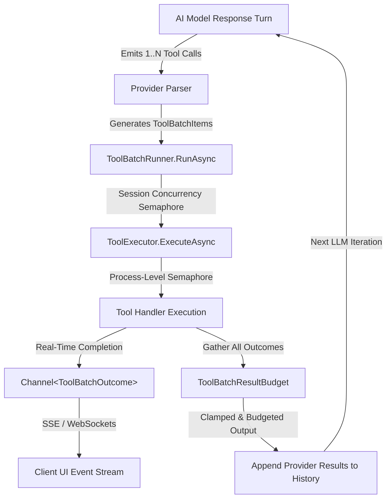

# Tool Batching & Parallel Execution Architecture

This document details the architectural design, concurrency models, rate limiting, output budget enforcement, and streaming lifecycle for tool execution in Gnoll Overseer.

---

## 1. Overview & Execution Pipeline

Overseer allows supported Large Language Models (LLMs) to call external and internal tools to retrieve wiki documentation, query game mechanics, search source code, and inspect GitHub repositories.

When an AI provider emits multiple tool calls in a single turn, Overseer executes them concurrently within a unified batch runner, streaming real-time status events back to the client while enforcing session and process-level throttles.

---

## 2. Multi-Tiered Concurrency & Rate Limiting

To balance fast response times against resource starvation and API throttling, tool execution is regulated across four distinct tiers:

| Tier | Component | Scope | Primary Settings / Defaults | Behavior When Exceeded |
|---|---|---|---|---|
| **Tier 1: Batching Concurrency** | `ToolBatchRunner` | Per Chat Turn | `AiPerformanceSettings:MaxParallelToolCalls` (Default: 6, Range: 1–10) `AiPerformanceSettings:MaxParallelClientToolCalls` (Default: 1, Range: 1–4) | Excess items queue asynchronously via `SemaphoreSlim`; none are dropped. |
| **Tier 2: Process Concurrency** | `ToolExecutor` | Process-Wide | `ToolExecutionLimits:MaxProcessParallelToolCalls` (Default: 30) `ToolExecutionLimits:MaxProcessExternalLookupCalls` (Default: 3) | Requests wait asynchronously across all concurrent users/sessions. |
| **Tier 3: Session Quotas & Timeouts** | `ToolExecutor` | Per Session / Tool | `AiPerformanceSettings:MaxCallsPerSession:Default` (Default: 30) `handler.TimeoutSeconds` (Per Tool Definition) | Session quota rejection (`Success=false`); execution cancellation on timeout. |
| **Tier 4: Batch Output Budget** | `ToolBatchResultBudget` | Per Batch Response | `ToolExecutionLimits:MaxBatchResultLength` (Default: 40,000 chars) | Truncates or skips trailing content in call order to preserve model context. |

### Tier 1: Session-Level Batching (`ToolBatchRunner`)

`ToolBatchRunner.RunAsync` coordinates parallel tool calls within a single model response turn:
- **Global Batch Semaphore**: Limits how many tools within the current request run simultaneously (`maxParallelTools`, default 6).
- **Client Tool Semaphore**: Dedicated throttle for UI/client bridge tools (`maxParallelClientTools`, default 1) to prevent overwhelming client-side interactive state.
- **Fail-Safe Processing**: Handler exceptions or cancellations are captured and returned as failed `ToolBatchOutcome` records; the runner never throws or crashes the chat turn.

### Tier 2: Process-Level Throttling (`ToolExecutor`)

`ToolExecutor` wraps individual tool executions with global throttles:
- **`_processThrottler`**: Limits total concurrent tool executions across the entire server process (default: 30).
- **`_externalLookupThrottler`**: Protects outbound rate limits for tools categorized as `ToolCategory.ExternalLookup` (default: 3 concurrent requests).

---

## 3. Tool Result Budgets & Truncation

To prevent large tool results (e.g. wide code searches or full wiki articles) from overflowing LLM context windows or incurring extreme token costs, Overseer applies two levels of size enforcement:

### 1. Per-Tool Clamping (`ToolExecutor`)
- Each tool result is checked against `ToolExecutionContext.MaxResultLength` (default: 3,000 characters).
- If the result exceeds this limit:
  - **Plain Text / Code**: Truncated to the limit with `... [Result truncated for length]` appended.
  - **Large JSON**: Replaced with an error asking the model to use a narrower query to prevent invalid JSON parsing errors.

### 2. Aggregate Batch Budget (`ToolBatchResultBudget`)
- The aggregate text across all tool results in a single turn cannot exceed `MaxBatchResultLength` (default: 40,000 characters).
- The effective budget dynamically expands to `Math.Max(budgetChars, execContext.MaxResultLength)` to ensure large per-tool allowances are accommodated.
- Results consume the budget sequentially in the order tool calls were emitted:
  - **Partial Truncation**: A result that partially fits is truncated with `\n\n... (truncated: batch output budget reached)`.
  - **Skipped Execution Results**: Results arriving after the budget is completely exhausted are replaced with `(skipped: batch output budget reached)`.

### 3. Heading-Scoped Wiki Snippet Extraction (`WikiSnippetExtractor`)
- For `wiki_search`, returning concatenated full articles risks a single large article (e.g. `Item Appearances.md` at 60 KB) consuming the entire `MaxResultLength` (default 10,000 chars), dropping subsequent search hits and evicting critical information.
- To eliminate this starvation defect, `WikiSearchTool` retrieves heading-scoped snippets via `WikiSnippetExtractor`:
  - Splits markdown into ordered sections preserving hierarchical heading paths (`Armor › Shields`).
  - Scores sections based on distinct query term matches, weighting heading matches 10× over body matches.
  - Assembles snippets in document order up to `Tools:wiki_search:PerResultChars` (default 2,500 chars).
  - Appends explicit omission markers (`[article: {filename} — {n} further section(s) omitted; use wiki_view for the full text]`) directing the LLM to call `wiki_view` for omitted text.
  - Appends `[article: {filename} — complete]` when all sections fit within the budget.
  - Falls back to the preamble and first section if no section matches query terms, ensuring non-empty results.

---

## 4. Real-Time Streaming via Channels

`ToolBatchRunner` publishes completion events as they finish to a `ChannelWriter<ToolBatchOutcome>`.

1. **Decoupled Execution & Streaming**: The chat engine (`ChatService`) consumes `outcomeChannel.Reader.ReadAllAsync()` immediately, forwarding SSE / WebSocket events (`tool_result`, `tool_error`, `debug`) to the client without waiting for slower parallel tools to finish.
2. **Order Preservation**: While results stream in completion order to the frontend UI, the final array returned by `ToolBatchRunner.RunAsync` preserves the exact original invocation order expected by LLM provider message histories.

---

## 5. System Prompt & Tool Policy Enforcement

The LLM is guided by strict batching and accuracy directives injected into Section 15 of the system prompt via `Overseer/ToolGuides/_policy.md` and `ToolRegistry.GetPolicyText()`.

### Mandatory Rules:
1. **Independent vs. Dependent Lookups**:
   - Independent lookups **must** be issued together in the same turn.
   - Dependent lookups (e.g. `wiki_search` followed by `wiki_view` using the discovered title) **must** remain sequential across turns.
2. **No Speculative Calls**: Models must not issue speculative "just in case" tool calls that consume shared batch budget.
3. **Accuracy About Tool Use**: Models must never claim to have run tools when answering from pre-existing context, and must accurately represent parallel vs. sequential execution.
4. **Handling Truncation**: When encountering truncation markers (`... (truncated: batch output budget reached)`, `(skipped: ...)`, `... [Result truncated for length]`), models must inform the user and issue targeted sequential follow-ups.

---

---

## 6. Per-Key Parallel Execution Mode

Overseer supports a tri-state **Per-Key Parallel Execution Mode** to accommodate free or low-tier API keys that hit aggressive rate limits (e.g. RPM/TPM restrictions):

| Mode | Enum Value | Description | Concurrency Enforcement | System Prompt Directive |
|---|---|---|---|---|
| **Disabled** | `0` | Sequential Only | `maxParallelTools = 1` `maxParallelClientTools = 1` `runBudget.MaxParallelSubAgents = 1` Deferred title generation until chat stream finishes | Injects `_policy_parallel_disabled.md` directing the model to emit tool calls strictly one at a time. |
| **OnRequest** | `1` | On Request Only | Standard full concurrency limits | Injects `_policy_parallel_on_request.md` directing the model to keep lookups sequential unless the user explicitly requested parallel execution. |
| **Enabled** | `2` | Full Parallel Execution (Default) | Standard full concurrency limits | Standard parallel execution guidance in `_policy.md`. No override block appended. |

### UI Indication & Controls
- **API Keys Settings**: Users can set parallel execution mode per provider (`Allowed`, `On request`, `Sequential only`).
- **Chat Model Selector**: Displays `Sequential` (solid amber) or `On request` (dashed amber) restriction badges when the active model's key is restricted.
- **AI Settings**: Users can toggle *Show parallel-execution badge in the model selector* on or off.

---

## 7. Testing & Verification

The tool batching and execution architecture is verified by 6 dedicated test fixtures under `Overseer.Tests/UnitTests/`:

- **`ParallelToolExecutionTests.cs`**: Verifies concurrent execution ordering, global and client semaphore throttles, cancellation propagation, and channel streaming in `ToolBatchRunner`.
- **`ParallelExecutionModeTests.cs`**: Verifies per-key mode resolution (`ParallelExecutionResolver`), prompt override injection, tool execution context cloning, and subagent concurrency limits.
- **`ToolBatchResultBudgetTests.cs`**: Verifies exact character budget consumption, truncation markers, and skip states in `ToolBatchResultBudget`.
- **`ToolExecutorRateLimitTests.cs`**: Verifies session-level call quotas and process-level semaphore throttles in `ToolExecutor`.
- **`ToolResultHandlingTests.cs`**: Verifies individual tool result clamping, JSON payload protection, and error handling.
- **`SystemPromptPolicyTests.cs`**: Verifies filesystem loading, content integrity, and mandatory parallelization policy strings in the system prompt.
