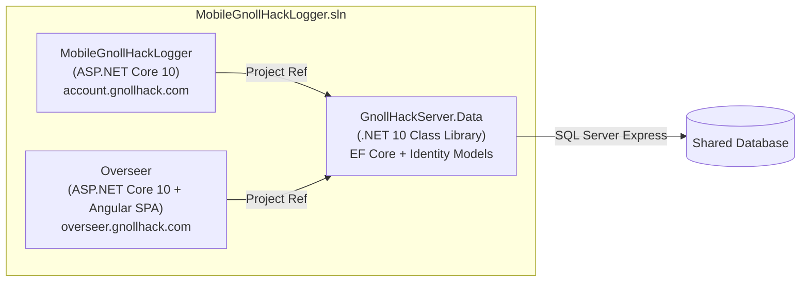

# Gnoll Overseer — Web App Implementation Plan

This plan details the creation of the **Gnoll Overseer** AI chat assistant as a modern web application, hosted at `overseer.gnollhack.com`, within the `MobileGnollHackLogger` solution.

## Architecture Overview

The `MobileGnollHackLogger.sln` solution will be refactored from 1 project to 3:



> [!IMPORTANT]
> **Shared Database**: Both web apps connect to the **same** SQL Server Express instance and database (`MobileGnollHackLogger`). The Overseer uses the existing `ApplicationUser` records for authentication — players log in with their GnollHack Account credentials. Chat sessions and encrypted API keys are stored in this shared database.

---

## Phase 1: Database Refactoring — `GnollHackServer.Data`

Extract all EF Core models and the `ApplicationDbContext` into a shared class library so both projects can reference them.

### [NEW] `GnollHackServer.Data` Project

A .NET 10 Class Library. (Note: delete the auto-generated `Class1.cs`).

#### Files to Move from `MobileGnollHackLogger/Data/`

All of the following files are in `c:\hmp\MobileGnollHackLogger\MobileGnollHackLogger\Data\`.
> [!CAUTION]
> **Use the `mv` command to move these files.** Do NOT copy them, otherwise you will cause duplicate class compilation errors.

| File | Notes |
|------|-------|
| [ApplicationDbContext.cs](file:///c:/hmp/MobileGnollHackLogger/MobileGnollHackLogger/Data/ApplicationDbContext.cs) | Inherits `IdentityDbContext` (non-generic). Contains `TopScoreNumberData` class, `OnModelCreating` overrides, and `GetTopScoreNumberAsync`. Has 5 DbSets: `GameLog`, `Bones`, `RequestLogs`, `BonesTransactions`, `SaveFileTrackings`. |
| `ApplicationUser.cs` | Extends `IdentityUser`. Has extra properties: `IsBanned`, `IsGameLogBanned`, `IsBonesBanned`, `JunetHackUserName`, and navigation property `GameLogs`. |
| `GameLog.cs` | Game log entity. Inherits from `XLogFileLine`. |
| `XLogFileLine.cs` | Base class for `GameLog`. ~900-line xlog format parser. |
| `Bones.cs` | Bones file entity. |
| `BonesTransaction.cs` | Transaction log entity. |
| `RequestInfo.cs` | Request logging entity. |
| `SaveFileTracking.cs` | Save file integrity entity. |
| `DbLogger.cs` | Database logger utility. **NOTE**: Contains an unused `using Azure.Core;` import — strip it after moving. |
| `GnollHackHelper.cs` | Static dictionaries for Roles, Difficulties, Modes. No external dependencies. |
| `BonesHelper.cs` | `VersionCompatibilityList` used by `BonesController`. |
| `DoubleExtensions.cs` | Extension methods used by data models. |
| `LogFileLogger.cs` | File-based logging utility. Uses `IConfiguration` (available from `Microsoft.Extensions.Configuration.Abstractions`, which is transitively referenced). |

> [!WARNING]
> **Do NOT move `EmailSender.cs`**: This file inherits from `Azure.Communication.Email.EmailClient` and implements `Microsoft.AspNetCore.Identity.UI.Services.IEmailSender`. Moving it would force the shared Data library to depend on Azure Communication Services and Identity UI NuGet packages, which is inappropriate. Keep it in `MobileGnollHackLogger`.


> [!WARNING]
> **Do NOT move `ModeModel.cs` or `DeathModel.cs`**: These are Razor Page models (`ModeModel : PageModel`, `DeathModel : ModeModel`). They are NOT referenced from any file in `Data/`. The plan previously claimed `GnollHackHelper.Modes` depends on `ModeModel` — this is incorrect; `Modes` is a simple `Dictionary<string, string>`. Keep both files in `MobileGnollHackLogger/Pages/`.

> [!IMPORTANT]
> **Migrations Stay in MobileGnollHackLogger**: Do NOT move the `Data/Migrations/` folder (~85 files). It must remain in the `MobileGnollHackLogger` project to preserve the EF Core `__EFMigrationsHistory` integrity. New migrations for Overseer entities will also be created in the `MobileGnollHackLogger` project.

#### New Entities for Overseer Chat

> [!NOTE]
> **Namespace for new entities**: These new entity classes are created directly in the `GnollHackServer.Data` project. Use the namespace `MobileGnollHackLogger.Data` (matching the existing entities) so that EF Core's `ModelSnapshot` treats them consistently. Add `using MobileGnollHackLogger.Data;` to any Overseer controller or service that references them.

| Entity | Fields |
|--------|--------|
| `ChatSession` | `long Id` (PK), `string AspNetUserId` (FK → `AspNetUsers.Id`), `[MaxLength(256)] string Title`, `DateTime CreatedUtc`, `DateTime LastMessageUtc` |
| `ChatMessage` | `long Id` (PK), `long ChatSessionId` (FK), `[MaxLength(32)] string Role` ("user"/"assistant"/"system"), `string Content` (no max length), `DateTime TimestampUtc`, `int? TokensUsed` |
| `UserAiSettings` | `string AspNetUserId` (PK/FK → `AspNetUsers.Id`), `[MaxLength(64)] string DefaultProvider`, `[MaxLength(128)] string DefaultModel`, `[MaxLength(2048)] string EncryptedApiKey`, `[MaxLength(32)] string ApiKeyNonce`, `[MaxLength(32)] string ApiKeyTag` |

Add these as `DbSet<ChatSession>`, `DbSet<ChatMessage>`, and `DbSet<UserAiSettings>` to `ApplicationDbContext`.

> [!CAUTION]
> **Cryptographic Best Practices for API Keys**: User AI provider API keys will be stored in `UserAiSettings` using **AES-256-GCM** (`System.Security.Cryptography.AesGcm`). 
> 
> *Implementation details:*
> - `AesGcm` exclusively uses `byte[]` arrays. The database stores these as Base64 strings: `EncryptedApiKey`, `ApiKeyNonce` (12 bytes), and `ApiKeyTag` (16 bytes). You MUST convert to/from Base64 strings when interacting with the DB.
> - **Nonce Generation**: `CryptoService` MUST generate a new, cryptographically secure random 12-byte nonce using `RandomNumberGenerator.Fill()` for *every* encryption operation. Do not reuse nonces.
> - **AAD Binding**: Pass the user's `AspNetUserId` as the Associated Data (AAD) during `Encrypt/Decrypt`. This binds the ciphertext to the user, preventing copying keys across database rows.
> - **Master Key**: 256-bit (32 bytes), stored securely in the server's environment configuration as a Base64 string (NOT in the database or `appsettings.json`). Load via `builder.Configuration["Overseer:AesEncryptionKey"]` and convert from Base64 to `byte[]`.

#### NuGet Packages for `GnollHackServer.Data`
| Package | Version |
|---------|---------|
| `Microsoft.AspNetCore.Identity.EntityFrameworkCore` | Latest 10.0.x |
| `Microsoft.EntityFrameworkCore.SqlServer` | Latest 10.0.x |
| `Microsoft.EntityFrameworkCore.Tools` | Latest 10.0.x |

> [!CAUTION]
> **Namespace Preservation (CRITICAL)**: The original `MobileGnollHackLogger.Data` namespace MUST be preserved for all moved entities (`ApplicationDbContext`, `ApplicationUser`, `GameLog`, etc.). If you change the namespace to `GnollHackServer.Data`, the `ModelSnapshot` in the existing migrations won't recognize them, triggering a disastrous drop/recreate of all tables. Keep `namespace MobileGnollHackLogger.Data` at the top of these files.

### [MODIFY] `MobileGnollHackLogger` Project
- Add `<ProjectReference Include="..\GnollHackServer.Data\GnollHackServer.Data.csproj" />`.
- Remove the EF Core NuGet packages that moved to the Data project (keep `Microsoft.EntityFrameworkCore.Design` and `Microsoft.EntityFrameworkCore.Tools` for migration tooling).
- Update `Program.cs`: `options.UseSqlServer(connectionString, b => b.MigrationsAssembly("MobileGnollHackLogger"))`.
- **CRITICAL**: Ensure its `appsettings.json` connection string includes `TrustServerCertificate=True` to prevent EF Core 10 connection errors.

> [!NOTE]
> **Solution Integration**: Run `dotnet sln add GnollHackServer.Data\GnollHackServer.Data.csproj` and `dotnet sln add Overseer\Overseer.csproj` to ensure the new projects compile together.

### [NEW] `Overseer` Project Reference
- Add `<ProjectReference Include="..\GnollHackServer.Data\GnollHackServer.Data.csproj" />` to `Overseer.csproj`.

---

## Phase 2: Overseer Web Application

### [NEW] `Overseer` Project

An ASP.NET Core 10 Web Application serving an **Angular SPA**. Use namespace `Overseer.Controllers` for controllers and `Overseer.Services` for services.

#### Frontend Framework Selection: Angular
Based on the requirement for a Google-recommended, enterprise-supported, TypeScript-native framework:
- **Google Recommended**: Built and maintained by Google.
- **TypeScript Native**: First-class TypeScript support with strict type safety.
- **AI & Human Manageable**: Angular's opinionated architecture (Components, Services, DI, RxJS) provides clear patterns that AI coding assistants excel at generating.
- **ASP.NET Core Integration**: Deep integration via `Microsoft.AspNetCore.SpaProxy`.

#### Angular Scaffolding

1. Create an Angular 18 workspace targeting `../wwwroot` to output directly into ASP.NET Core's static files directory.
2. Build with `--ssr=false` to ensure a pure Client-Side Rendering SPA, avoiding any Node.js hydration (`NG0500`) issues.
3. The Angular SPA MUST be built using the modern Angular 18+ Standalone Component architecture (no `NgModules`).

```bash
cd Overseer
npx @angular/cli@18 new ClientApp --directory ClientApp --routing=true --style=scss --ssr=false --skip-git
```

> [!TIP]
> **Project Scaffolding**: Use `dotnet new webapi -n Overseer` to scaffold the ASP.NET Core backend first, then run the `ng new` command above from inside the `Overseer/` directory.

#### ASP.NET Core + Angular Integration Steps

1. In `Overseer.csproj`, configure `SpaProxy` properties: `<SpaRoot>ClientApp\</SpaRoot>`, `<SpaProxyServerUrl>https://localhost:44447</SpaProxyServerUrl>`, `<SpaProxyLaunchCommand>npm start</SpaProxyLaunchCommand>`.
2. Add `Microsoft.AspNetCore.SpaProxy` NuGet package.
3. In `ClientApp/angular.json`, flatten the `"outputPath"` to `{ "base": "../wwwroot", "browser": "" }` so that `ng build` places the frontend bundle exactly where ASP.NET Core's `UseStaticFiles()` expects it. Also update the `start` script in `package.json` to `"ng serve --port 44447"`.
4. Add an MSBuild `<Target>` in `Overseer.csproj` hooked to `ComputeFilesToPublish` to run `npm ci` and `npm run build` during publish. **CRITICAL**: You must explicitly define `ResolvedFileToPublish` inside the target (not globally) because MSBuild evaluates globs before targets run:

```xml
<Target Name="PublishAngular" AfterTargets="ComputeFilesToPublish">
  <Exec WorkingDirectory="ClientApp" Command="npm ci" />
  <Exec WorkingDirectory="ClientApp" Command="npm run build -- --configuration production" />
  <ItemGroup>
    <DistFiles Include="wwwroot\**" />
    <ResolvedFileToPublish Include="@(DistFiles->'%(FullPath)')" Exclude="@(ResolvedFileToPublish)">
      <RelativePath>wwwroot\%(RecursiveDir)%(FileName)%(Extension)</RelativePath>
      <CopyToPublishDirectory>PreserveNewest</CopyToPublishDirectory>
      <ExcludeFromSingleFile>true</ExcludeFromSingleFile>
    </ResolvedFileToPublish>
  </ItemGroup>
</Target>
```

> [!TIP]
> **`proxy.conf.json`**: Create `Overseer/ClientApp/proxy.conf.json` to proxy API requests from the Angular dev server to the .NET backend port during development:
> ```json
> {
>   "/api": {
>     "target": "https://localhost:7001",
>     "secure": false,
>     "changeOrigin": true
>   }
> }
> ```
> Then reference it in `angular.json` under `projects.ClientApp.architect.serve.options`:
> ```json
> "proxyConfig": "proxy.conf.json"
> ```
> Adjust the target port to match the Overseer's HTTPS launch port from `launchSettings.json`.

> [!TIP]
> **`.gitignore` Updates**: Since `--skip-git` prevents Angular from generating its own `.gitignore`, add the following entries to the repository's root `.gitignore`:
> ```gitignore
> Overseer/wwwroot/
> Overseer/ClientApp/node_modules/
> Overseer/ClientApp/.angular/
> ```

#### Configuration (`appsettings.json`)
```json
{
  "ConnectionStrings": {
    "SqlDatabaseConnection": "Server=.\\SQLEXPRESS;Database=MobileGnollHackLogger;Trusted_Connection=True;MultipleActiveResultSets=true;TrustServerCertificate=True"
  },
  "MauiClientSecret": "<same value as MobileGnollHackLogger's AntiForgery configuration>",
  "Overseer": {
    "WikiPath": "c:\\wiki",
    "MaxWikiFilesToInclude": 5,
    "MaxWikiFileSizeKB": 100
  }
}
```

> [!WARNING]
> **`MauiClientSecret`**: The `SessionController` validates the MAUI client's static token using `_configuration["MauiClientSecret"]` (this is the exact same string value used by `LogController` / `BonesController` in `MobileGnollHackLogger`, just renamed here to avoid AI confusion with ASP.NET Core's built-in `IAntiforgery` system). This value must be deployed in the server's configuration.

> [!IMPORTANT]
> The `AesEncryptionKey` must NOT be in `appsettings.json`. Store it in environment variables or a secrets manager and access via `builder.Configuration["Overseer:AesEncryptionKey"]`.

#### `Program.cs` — DI & Middleware
```csharp
using MobileGnollHackLogger.Data;  // Shared entities (ApplicationDbContext, ApplicationUser, etc.)
using Microsoft.AspNetCore.Identity;

var builder = WebApplication.CreateBuilder(args);
string? connectionString = builder.Configuration["ConnectionStrings:SqlDatabaseConnection"];

// NOTE: No MigrationsAssembly needed — Overseer does not run migrations
builder.Services.AddDbContext<ApplicationDbContext>(options => options.UseSqlServer(connectionString));

// Register ASP.NET Identity (API only - no Razor UI pages)
builder.Services.AddIdentityCore<ApplicationUser>(options =>
{
    options.SignIn.RequireConfirmedAccount = true;
    options.User.RequireUniqueEmail = true;
})
.AddEntityFrameworkStores<ApplicationDbContext>()
.AddSignInManager<SignInManager<ApplicationUser>>();

builder.Services.AddAuthentication(IdentityConstants.ApplicationScheme)
    .AddCookie(IdentityConstants.ApplicationScheme, options =>
    {
        options.Events.OnValidatePrincipal = SecurityStampValidator.ValidatePrincipalAsync; // CRITICAL: Prevent stale cookies (requires `using Microsoft.AspNetCore.Identity;`)
        // Override default cookie behavior for SPA — return 401/403 instead of HTML redirects
        options.Events.OnRedirectToLogin = context =>
        {
            context.Response.StatusCode = 401;
            return Task.CompletedTask;
        };
        options.Events.OnRedirectToAccessDenied = context =>
        {
            context.Response.StatusCode = 403;
            return Task.CompletedTask;
        };
    })
    .AddCookie(IdentityConstants.ExternalScheme) // CRITICAL: Required for SignInManager cleanup
    .AddCookie(IdentityConstants.TwoFactorUserIdScheme); // CRITICAL: Required for SignInManager cleanup

builder.Services.AddAntiforgery(options =>
{
    options.HeaderName = "X-XSRF-TOKEN"; // Expected by Angular
});

builder.Services.AddAuthorization();
builder.Services.AddControllers(options => 
{
    options.Filters.Add(new Microsoft.AspNetCore.Mvc.AutoValidateAntiforgeryTokenAttribute()); // CRITICAL: Enforce CSRF validation globally
});
builder.Services.AddMemoryCache(options => options.SizeLimit = 10000); // Size limit to prevent DoS

// Register Overseer services
builder.Services.AddSingleton<WikiService>();
builder.Services.AddSingleton<CryptoService>();
builder.Services.AddScoped<ChatService>();
builder.Services.AddScoped<SettingsService>();

var app = builder.Build();

if (app.Environment.IsDevelopment())
    app.UseDeveloperExceptionPage();
else
    app.UseExceptionHandler("/error"); // Global exception handler

app.UseHttpsRedirection();
app.UseStaticFiles();
app.UseRouting();
app.UseAuthentication();
app.UseAuthorization();

// Middleware to issue CSRF cookie to SPA (skip APIs)
app.Use((context, next) =>
{
    if (!context.Request.Path.Value!.StartsWith("/api", StringComparison.OrdinalIgnoreCase))
    {
        var antiforgery = context.RequestServices.GetRequiredService<Microsoft.AspNetCore.Antiforgery.IAntiforgery>();
        var tokens = antiforgery.GetAndStoreTokens(context);
        context.Response.Cookies.Append("XSRF-TOKEN", tokens.RequestToken!, new CookieOptions { HttpOnly = false, Secure = true });
    }
    return next(context);
});

app.MapControllers();

// SPA Fallback to Angular index.html
app.MapFallbackToFile("index.html");

app.Run();
```

---

### Backend Services

#### [NEW] `Services/CryptoService.cs`
Handles AES-256-GCM encryption/decryption of the user's BYOK API key stored in `UserAiSettings`. Injected as a **singleton**. Inject `IConfiguration` to read the master key. Expose `Encrypt(plaintext, userId) → (ciphertext, nonce, tag)` and `Decrypt(ciphertext, nonce, tag, userId) → plaintext` methods, all working with Base64 strings. **CRITICAL**: You must instantiate `AesGcm` using a `using` statement and manually allocate the ciphertext array (`new byte[plaintextBytes.Length]`) and tag array (`new byte[16]`) before calling `.Encrypt()`. Must use `RandomNumberGenerator` for the 12-byte nonce. **CRITICAL**: For the AAD binding, do NOT try to decode the `userId` from Base64 (it is a standard string/GUID). Use `Encoding.UTF8.GetBytes(userId)`.

#### [NEW] `Services/SettingsService.cs`
Handles `UserAiSettings` CRUD operations. Expose endpoints to test and save the user's BYOK (Bring Your Own Key) credentials. Uses `CryptoService` for encrypt/decrypt.

#### [NEW] `Services/WikiService.cs`
Reads GnollHack Wiki files from the configurable path (`Overseer:WikiPath`, defaults to `c:\wiki`) to augment AI prompts with relevant context (RAG). Injected as a **singleton**. Indexes `.md`/`.txt` files on startup and matches keywords from user queries to provide context snippets.

> [!NOTE]
> **Supported AI Providers**: Implement standard clients for OpenAI (`gpt-4o`, `gpt-4o-mini`), Anthropic (`claude-3-5-sonnet-20240620`), and Google (`gemini-1.5-pro`, `gemini-1.5-flash`). Use standard HTTP clients or their respective official .NET SDKs.
>
> **WikiService RAG Strategy**: Keep it simple. To match keywords from the user's query against the GnollHack markdown files, extract query words > 4 characters and use case-insensitive `string.Contains` to count hits on the `.md` content. Do NOT implement a Vector DB or TF-IDF.

#### [NEW] `Services/ChatService.cs`
Core AI orchestration. Injected as **scoped**. Loads the user's decrypted API key (via `CryptoService`), fetches Wiki context (via `WikiService`), reads conversation history from `ChatSession`/`ChatMessage`, and calls the LLM. Returns an `IAsyncEnumerable<string>` which the `ChatController` iterates over to write SSE frames.

> [!CAUTION]
> **DB Connection Pool Exhaustion**: `ChatService` MUST NOT hold the `ApplicationDbContext` open while yielding chunks from the LLM (which takes 10-30 seconds). Doing so will instantly exhaust the 100-connection DB pool under load. **You MUST inject `IServiceScopeFactory`** and use discrete `using var scope = _scopeFactory.CreateScope()` blocks for database operations *before* the LLM stream begins (to load history and save the user message) and *after* it completes (to save the assistant's response). Do NOT inject `ApplicationDbContext` directly into `ChatService`.

> [!NOTE]
> **Identity Registration**: Uses `AddIdentityCore<ApplicationUser>` (instead of `AddDefaultIdentity`) to get `SignInManager<ApplicationUser>`, `UserManager<ApplicationUser>`, and the Identity cookie middleware *without* pulling in unnecessary HTML Razor UI pages from `Microsoft.AspNetCore.Identity.UI`. The `ConfigureApplicationCookie` override ensures the SPA receives a `401` status code (not an HTML redirect) when the user is unauthenticated. Note: `ApplicationDbContext` inherits non-generic `IdentityDbContext` (which defaults to `IdentityUser`), but `AddEntityFrameworkStores<ApplicationDbContext>()` works correctly because `ApplicationUser : IdentityUser` satisfies the constraint.

#### [NEW] `Controllers/AuthController.cs`
Handles SPA authentication. **No registration functionality** — registration remains at `account.gnollhack.com`.

| Endpoint | Method | Description |
|----------|--------|-------------|
| `/api/auth/login` | POST | Accepts `{ userName, password }`. Validates via `SignInManager<ApplicationUser>.PasswordSignInAsync()`. On success, the Identity cookie is issued automatically. Returns user info JSON. |
| `/api/auth/logout` | POST | Calls `SignInManager.SignOutAsync()` to clear the Identity cookie. |
| `/api/auth/me` | GET | Returns current user info (username, email) and whether an API key is configured. Returns 401 if not authenticated. |
| `/api/auth/handoff` | GET | **Context Handoff Bridge**. Accepts `?token={token}&sessionId={sessionId}`. Validates the token against `IMemoryCache` (issued by `SessionController`), ensuring BOTH the User ID and Session ID match the cached entry. Calls `SignInManager.SignInAsync(user, false)` to issue the Identity cookie to the WebView context. **CRITICAL**: Return a `200 OK` with a client-side HTML `<meta http-equiv="refresh" content="0;url=/?sessionId={sessionId}">` redirect, NOT a `302 Redirect`. (iOS `WKWebView` drops `Set-Cookie` headers if immediately followed by a 302). |

> [!NOTE]
> **Authentication Isolation**: The Overseer uses `SignInManager<ApplicationUser>` to securely validate passwords and issue the Identity session cookie. It does NOT share a cookie domain with `account.gnollhack.com`. Users log in separately on each subdomain, keeping authentication state safely in-process per web app.

#### [NEW] `Controllers/ChatController.cs`

| Endpoint | Method | Description |
|----------|--------|-------------|
| `/api/chat/sessions` | GET | List user's chat sessions, ordered by `LastMessageUtc` descending. `[Authorize]`. |
| `/api/chat/sessions/{id}` | GET | Get a specific session with its messages. `[Authorize]`. |
| `/api/chat/sessions/{id}` | DELETE | Delete a session and its messages. `[Authorize]`. |
| `/api/chat/send` | POST | Send a message. Streams response using Server-Sent Events. `[Authorize]`. Expects `{ sessionId?: number, message: string }`. **CRITICAL**: If `sessionId` is missing or 0, you must first create and save a new `ChatSession` (and generate its `Title`) before streaming the response. |

> [!CAUTION]
> **SSE Protocol Compliance**: ASP.NET Core does NOT natively format `IAsyncEnumerable` as Server-Sent Events (it formats as a chunked JSON array). For `/api/chat/send`, the action method MUST return `Task` (not `IActionResult`) and manually write SSE frames to the response body. 
> Furthermore, if an LLM chunk contains newlines (e.g., Markdown), the SSE protocol strictly requires every line to be prefixed with `data: `.
> ```csharp
> [HttpPost("send")]
> [Authorize]
> public async Task Send([FromBody] SendMessageRequest request, CancellationToken cancellationToken) // CRITICAL: Bind CancellationToken to catch client disconnects
> {
>     Response.ContentType = "text/event-stream";
>     Response.Headers.Append("Cache-Control", "no-cache"); // CRITICAL: Prevent IIS/proxy buffering
>     Response.Headers.Append("Connection", "keep-alive");
>     
>     try 
>     {
>         await foreach (var chunk in _chatService.StreamMessageAsync(request.SessionId, request.Message, User, cancellationToken))
>         {
>             var formattedChunk = chunk.Replace("\n", "\ndata: ");
>             await Response.WriteAsync($"data: {formattedChunk}\n\n", cancellationToken);
>             await Response.Body.FlushAsync(cancellationToken);
>         }
>     }
>     catch (Exception ex) when (ex is not OperationCanceledException)
>     {
>         // Send SSE error event so the client doesn't hang
>         await Response.WriteAsync($"event: error\ndata: {{\"message\": \"An error occurred.\"}}\n\n");
>         await Response.Body.FlushAsync();
>     }
> }
> ```

#### [NEW] `Controllers/SettingsController.cs`

| Endpoint | Method | Description |
|----------|--------|-------------|
| `/api/settings` | GET | Returns the user's current AI settings (provider, model, whether an API key is stored). `[Authorize]`. Do NOT return the decrypted API key — return only a boolean `hasApiKey`. |
| `/api/settings` | PUT | Accepts `{ provider, model, apiKey }`. Encrypts the API key via `CryptoService` and saves to `UserAiSettings`. `[Authorize]`. |
| `/api/settings/test` | POST | Accepts `{ provider, model, apiKey }`. Makes a lightweight test call to the AI provider (e.g., a simple "say hello" prompt) and returns success/failure. `[Authorize]`. Does NOT save the key. |

#### [NEW] `Controllers/SessionController.cs`

| Endpoint | Method | Description |
|----------|--------|-------------|
| `/api/session/create` | POST | **Context handoff from MAUI client**. Accepts `MultipartFormDataContent` with `UserName`, `Password`, `AntiForgeryToken`, and `SnapshotHtml` fields. **CRITICAL**: Because this is called by a native client, decorate with `[IgnoreAntiforgeryToken]`. The MAUI client sends the static secret in a form field named `AntiForgeryToken` (matching the existing `LogController`/`BonesController` pattern). On the server, you must validate this field value against `_configuration["MauiClientSecret"]`. Do NOT use ASP.NET Core's `IAntiforgery` service — this is a simple string comparison, NOT a CSRF token. Validates credentials via `SignInManager.CheckPasswordSignInAsync(user, password, lockoutOnFailure: true)` (do NOT use `PasswordSignInAsync` here, and do not use simple `UserManager` hash checks — you must respect lockouts). Creates a new `ChatSession` with the snapshot as a system message. Generates a secure random string token and stores it in `IMemoryCache` bound to BOTH the `UserId` and `SessionId` (e.g. `$"handoff_{token}"`). **CRITICAL**: Configure the cache entry with `Size = 1` and `AbsoluteExpirationRelativeToNow = TimeSpan.FromMinutes(2)` to prevent memory leaks/DoS. Returns `{ sessionId, handoffToken }`. |

> [!IMPORTANT]
> **MAUI Client Authentication & WebView Handoff**: The `/api/session/create` endpoint validates MAUI client credentials without issuing cookies (since the HttpClient's cookie jar is discarded). It returns a short-lived `handoffToken`. The MAUI client then opens the WebView to `/api/auth/handoff?token={handoffToken}&sessionId={sessionId}`. This backend endpoint consumes the token, issues the auth cookie directly into the WebView's browser context, and redirects to the Angular chat SPA.

> [!WARNING]
> **Handoff Token Security**: The `/api/auth/handoff` endpoint uses a GET request with the token in the query string for WebView compatibility. The token MUST be single-use (delete from `IMemoryCache` after consumption) and short-lived (2 minute expiry). Configure your web server to avoid logging query strings for `/api/auth/handoff`, or consider URL-rewrite to strip the token from logs.

---

### Frontend SPA (Angular)

Located in `Overseer/ClientApp/` (scaffolded via `dotnet new angular` if the template is available, or manually via `ng new` — see scaffolding instructions above).

**Configuration:**
- **Functional HTTP Interceptor**: Modern Angular (v18+) uses functional interceptors, not class-based `HttpInterceptor`. Create an interceptor function and register it via `provideHttpClient(withInterceptors([authInterceptor]))` in `app.config.ts`. This interceptor must set `withCredentials: true` on all requests so the Identity cookie is sent to the backend.

```typescript
// src/app/auth.interceptor.ts
import { HttpInterceptorFn, HttpErrorResponse } from '@angular/common/http';
import { inject } from '@angular/core';
import { Router } from '@angular/router';
import { catchError, throwError } from 'rxjs';

export const authInterceptor: HttpInterceptorFn = (req, next) => {
  const router = inject(Router);
  const cloned = req.clone({ withCredentials: true });
  
  return next(cloned).pipe(
    catchError((error: HttpErrorResponse) => {
      if (error.status === 401) router.navigate(['/login']);
      return throwError(() => error);
    })
  );
};

// src/app/app.config.ts
import { ApplicationConfig } from '@angular/core';
import { provideRouter } from '@angular/router';
import { provideHttpClient, withInterceptors, withXsrfConfiguration } from '@angular/common/http';
import { authInterceptor } from './auth.interceptor';
import { routes } from './app.routes';

export const appConfig: ApplicationConfig = {
  providers: [
    provideRouter(routes),
    provideHttpClient(
      withInterceptors([authInterceptor]),
      withXsrfConfiguration({ cookieName: 'XSRF-TOKEN', headerName: 'X-XSRF-TOKEN' })
    ),
  ],
};
```

**Structure:**
- **`src/app/auth/`**: Login component and `AuthGuard`. **CRITICAL**: The `AuthGuard` must rely on `AuthService` state (initialized by calling `/api/auth/me` on load). Do not implement JWT checks or `localStorage` parsing.
- **`src/app/chat/`**: Chat UI — message list, input box, Markdown rendering (`ngx-markdown`). **CRITICAL**: The Chat UI must inject `ActivatedRoute` to parse `queryParamMap.get('sessionId')` on load, allowing it to seamlessly resume a session passed from the MAUI handoff redirect.
- **`src/app/sidebar/`**: Session history sidebar component.
- **`src/app/settings/`**: UI to input the BYOK API key and select preferred AI model/provider.
- **`src/app/services/`**: `AuthService`, `ChatService` (API calls + SSE), `SettingsService`.

**Server-Sent Events (SSE) Implementation:**
> [!WARNING]
> Do **NOT** use Angular's `HttpClient.post()` for the SSE streaming endpoint (`/api/chat/send`), as it buffers the entire response before returning. Use the `@microsoft/fetch-event-source` npm package, which supports POST requests, custom headers, cookies, and proper SSE frame parsing (`data: ...\n\n`):
> ```typescript
> import { fetchEventSource } from '@microsoft/fetch-event-source';
> import { HttpXsrfTokenExtractor } from '@angular/common/http';
> import { NgZone, inject } from '@angular/core';
>
> // Inside your ChatService:
> // constructor(private xsrfExtractor: HttpXsrfTokenExtractor, private ngZone: NgZone) {}
> 
> streamChat(sessionId: number, message: string, onChunk: (text: string) => void): void {
>   const xsrfToken = this.xsrfExtractor.getToken();
>   fetchEventSource('/api/chat/send', {
>     method: 'POST',
>     headers: {
>       'Content-Type': 'application/json',
>       'X-XSRF-TOKEN': xsrfToken || '',
>     },
>     body: JSON.stringify({ sessionId, message }),
>     credentials: 'include',
>     onmessage: (ev) => {
>       this.ngZone.run(() => {
>         onChunk(ev.data); // CRITICAL: Run in NgZone so Angular UI updates
>       });
>     },
>     onerror: (err) => {
>       if (err.status === 401) {
>         window.location.href = '/login'; // Handle expired cookie mid-stream
>       }
>       throw err; // Stop retrying on other errors
>     },
>     onclose() {
>       throw new Error('Stream closed'); // CRITICAL: Prevents fetchEventSource from auto-reconnecting
>     }
>   });
> }
> ```
> Install via: `npm install @microsoft/fetch-event-source`

**Styling & UI:**
- Follows Google's Modern Web Guidance.
- **SCSS Strategy**: You MUST define a global `styles.scss` with CSS custom properties (`:root { --bg-color: #1a1a2e; --accent-gold: #d4af37; --chat-bubble: #f1e4c3; }`). Do not hardcode hex values in scoped component SCSS. 
- **Breakpoints**: You MUST create a global `_breakpoints.scss` with responsive mixins (e.g., `@mixin respond-to($breakpoint)`) and use it across components. Do not hardcode `@media` pixel values locally.
- **Theme**: Deep dungeon-dark background (`var(--bg-color)`), gold accents (`var(--accent-gold)`), parchment-like AI message bubbles (`var(--chat-bubble)`).
- **Glassmorphism**: Frosted glass sidebar and input bar using `backdrop-filter: blur()`.
- **Typography**: Cinzel (headings), Lato (body) — imported from Google Fonts.
- **Responsive**: Mobile-first layout. Sidebar collapses to a hamburger menu at `< 768px`.
- **Accessibility (a11y)**: MUST use Semantic HTML (`<main>`, `<aside>`). MUST use a visually hidden ARIA live region (`aria-live="polite"`) to announce when the AI is typing or finished. MUST manage focus programmatically when switching sessions or stopping generation.

**Key UI Features:**
| Feature | Implementation |
|---------|---------------|
| Missing API Key Flow | If `/api/auth/me` returns no API key, the Chat UI must be disabled and display a call-to-action button redirecting to the Settings page. |
| Chat sidebar with session history | Angular sidebar component, loaded from `/api/chat/sessions` |
| Auto-title from first message | Backend generates title from the first user message if `sessionId` is omitted |
| Markdown rendering in AI responses | Client-side via `ngx-markdown` library. **CRITICAL**: Must enable HTML sanitization (`MarkdownModule.forRoot({ sanitize: SecurityContext.HTML })`) to prevent XSS. |
| Stop Generation button | Pass an `AbortController` to `fetchEventSource`'s `signal` option. Call `controller.abort()` to stop the stream. |
| Auto-scroll to latest message | Angular `scrollIntoView()` after each chunk |
| GnollHack visual aesthetic | SCSS custom properties + Glassmorphism + Google Fonts |

---

## Phase 3: Solution Structure Update

### Final Directory Structure
```
c:\hmp\MobileGnollHackLogger\           (solution root)
├── MobileGnollHackLogger.sln
├── GnollHackServer.Data\               (shared class library)
│   ├── GnollHackServer.Data.csproj
│   ├── ApplicationDbContext.cs
│   ├── ApplicationUser.cs
│   ├── GameLog.cs, XLogFileLine.cs, Bones.cs, etc.
│   ├── ChatSession.cs, ChatMessage.cs, UserAiSettings.cs   ← NEW
│   ├── GnollHackHelper.cs, BonesHelper.cs, etc.
│   └── DoubleExtensions.cs, LogFileLogger.cs, DbLogger.cs
├── MobileGnollHackLogger\              (existing web app)
│   ├── MobileGnollHackLogger.csproj
│   ├── Program.cs
│   ├── Data\Migrations\                ← stays here
│   ├── Areas\API\
│   ├── Pages\
│   └── wwwroot\
└── Overseer\                            (NEW web app)
    ├── Overseer.csproj
    ├── Program.cs, appsettings.json
    ├── Services\ (ChatService, WikiService, CryptoService, SettingsService)
    ├── Controllers\ (AuthController, ChatController, SettingsController, SessionController)
    └── ClientApp\                       (Angular SPA)
        ├── src\app\
        ├── package.json
        └── angular.json
```

---

## Verification Plan

### Phase 1 Verification (Database Refactoring)
- [ ] `dotnet build MobileGnollHackLogger.sln` succeeds with all 3 projects.
- [ ] Run `MobileGnollHackLogger` locally — verify leaderboards, recent games, bones sharing all still work.
- [ ] Run `Add-Migration AddOverseerTables` from `MobileGnollHackLogger` project — verify migration generates cleanly for `ChatSession`, `ChatMessage`, `UserAiSettings`.
- [ ] Run `Update-Database` — verify tables are created in SQL Server Express.

### Phase 2 Verification (Overseer Web App)
- [ ] Run `Overseer` locally — verify the Angular app loads.
- [ ] Navigate to the login page, log in with GnollHack Account credentials.
- [ ] Provide an API Key in the Settings page — verify it encrypts and saves to `UserAiSettings` in the DB.
- [ ] Send a message — verify SSE streaming response from the AI.
- [ ] Place test `.md` files in `c:\wiki` — verify the AI references wiki content in responses.
- [ ] Create multiple chat sessions — verify sidebar lists them correctly.

### Phase 3 Verification (Integration with GnollHack Client)
- [ ] From the MAUI client, POST an AI snapshot to `/api/session/create` — verify `{ sessionId, handoffToken }` JSON is returned.
- [ ] Open the WebView to `/api/auth/handoff?token={handoffToken}&sessionId={sessionId}` — verify it sets the auth cookie and redirects to the Angular SPA with the chat session loaded.
