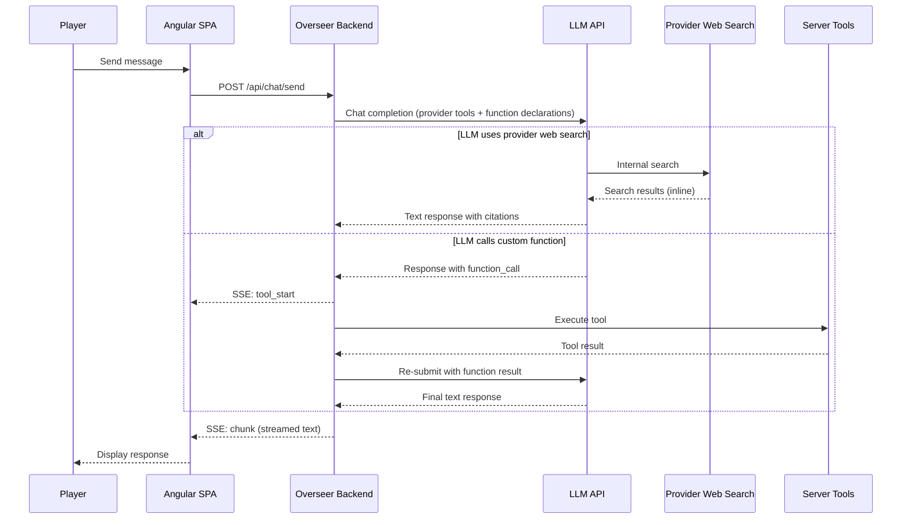
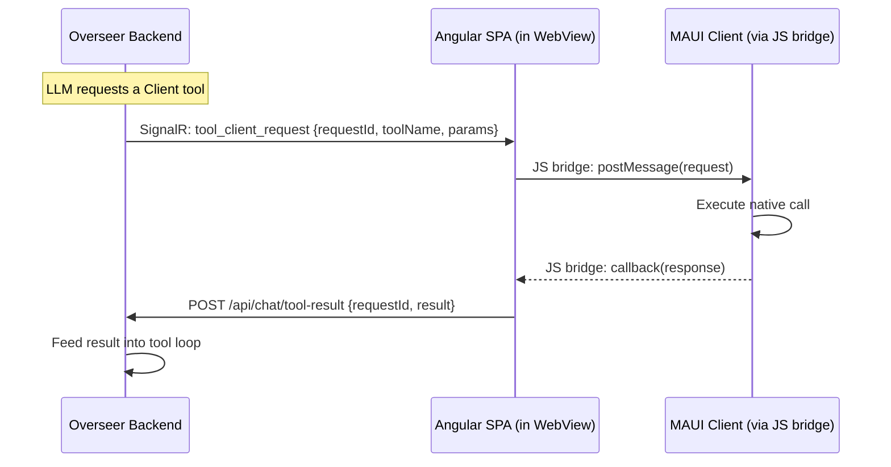

# Overseer Tool Use — Server-Side Implementation Plan

*For the Overseer backend developer. Covers all changes to the `MobileGnollHackLogger/Overseer` project, the Angular SPA, and the shared database.*

---

## Background

Today the Overseer AI is a **pure chat assistant**: it receives a static game snapshot at session start, wiki context via RAG, and optional attachments. `ChatService.cs` makes a single LLM call and streams the response. There is no tool use / function calling.

This plan adds **tool use** capabilities, allowing the AI to invoke server-defined tools (wiki search, monster lookup, etc.) during a conversation. The architecture also prepares for **future client-side tools** (v2) where the MAUI game client handles execution via a JavaScript bridge — but all v1 work is server-side.

---

## Decisions

| Decision | Value |
|----------|-------|
| **Provider priority** | Google Gemini first, then OpenAI and Anthropic |
| **v1 tools** | Read-only only — no game state modification |
| **Max tool call iterations per turn** | 5 (configurable) |
| **User opt-in** | Four separate toggles (see Settings section) |
| **Wiki search** | Expand beyond current keyword matching |
| **Client-side tools** | v2 — but `IClientToolBridge` interface is created now as a no-op |

---

## Startup Optimization: Reduced Upload Payload

> [!IMPORTANT]
> **Breaking change from the current protocol.** The MAUI client will **no longer send** `MessageHistory` or `DirectoryManifest` fields in `POST /api/session/create`. The server must handle their absence gracefully. These data are now accessible only via tools.

### What Changes

| Data | Before | After |
|------|--------|-------|
| **SnapshotHtml** | Uploaded at session start | ✅ **No change** — still uploaded in full |
| **OverseerSettings** | Uploaded at session start | ✅ **No change** — still uploaded in full |
| **MessageHistory** | Uploaded (up to 128KB), saved to disk, 2000-char preview as system message | ❌ **No longer uploaded.** Not available at session start. Accessible via v2 client tool. |
| **DirectoryManifest** | Uploaded in dev mode, saved as system message | ❌ **No longer uploaded.** Accessible via v2 client tool. |

### AI Snapshot Now Includes Recent Messages

The C core's `GenerateAiSnapshot()` is being updated (by the client team) to include the **last ~50 in-game messages** directly in the snapshot HTML. Previously the snapshot had version, character, map, and status only — messages were supplied separately. Now the AI has recent message context embedded in the snapshot itself, without needing a separate upload.

### Server Changes for Startup Optimization

#### SessionController.cs

- The `MessageHistory` and `DirectoryManifest` fields in `CreateSessionRequest` become **optional/nullable**.
- **Backward Compatibility (Critical):** Older client versions will still send `MessageHistory`. The server MUST check if `MessageHistory` is provided in the payload.
  - If empty/null (new clients): Do not create the truncated message preview system message.
  - If provided (old clients): Preserve the old behavior! Inject the truncated history into the system prompt or append it to the snapshot, so older clients don't lose message history context.
- Keep the `DirectoryManifest` disk-save code but guard it — it won't receive data in v1

#### ChatService.cs / BuildSystemPrompt

- **Update** `hasMessageHistory` flag logic — it should only be `true` if `MessageHistory` was explicitly provided by an older client.
- Remove the `hasDirectoryManifest` flag and its system prompt references
- The system prompt should note that the AI snapshot includes recent messages, and that full message history is available via a tool (when client tools are enabled in v2)

---

## Three-Tier Tool Architecture

Tools are organized by **where they execute**. The server must handle all three tiers, but only Tier 1 and Tier 2 are implemented in v1.

### Tier 1: Provider Native Tools (Web Search)

Built into the LLM provider's API. The provider executes them internally — no tool loop needed on our end.

| Provider | Tool | Wire Format | Notes |
|----------|------|-------------|-------|
| **Google Gemini** | `googleSearch` | Add `{"googleSearch": {}}` to the `tools` array, **separate** from `{function_declarations: [...]}` | Response includes `groundingMetadata` with citations |
| **OpenAI** | `web_search` | Add `{type: "web_search"}` to the `tools` array, alongside `{type: "function", ...}` entries | Response includes inline citations |
| **Anthropic** | `web_search` | Add `{type: "web_search_20260318", name: "web_search"}` to the `tools` array | Anthropic handles this via its server-side tool execution flow; results are returned inline in the streaming response with citations |

**Key points:**
- Controlled by user's `EnableWebSearch` setting
- No tool loop needed — results come back inline in the normal response
- Streaming parsers may need minor updates to pass through grounding/citation metadata

### Tier 2: Server-Side Tools (Custom Function Calls)

Defined by us as function declarations. The LLM requests a call → we execute on our backend → we re-submit the result → the LLM continues.

- `wiki_search`, `monster_lookup`, `item_lookup`, `nethack_wiki_search`
- **Requires a tool loop** in `ChatService.cs`
- Controlled by user's `EnableToolUse` setting
- Each iteration costs an additional API completion request

### Tier 3: Client-Side Tools (v2 — Interface Only in v1)

Same function calling protocol as Tier 2, but execution is routed through a JavaScript bridge to the MAUI game client. From the LLM's perspective, these are identical to server-side tools.

v2 client tools include:
- `get_full_message_history` — requests the full message log from the game client
- `get_directory_listing` — requests the game directory manifest (dev mode)
- `refresh_snapshot` — requests a fresh game snapshot
- `get_save_info` — reads save file metadata

**v1 requirement:** Create the `IClientToolBridge` interface and register a no-op implementation in DI.

---

## Architecture Diagrams

### v1 Flow: Provider Tools + Server Tools



### v2 Flow: Client-Side Tool (Future)



---

## Tool Guide Files

Tool documentation is stored as **markdown files on disk** rather than hardcoded in C# or placed in the system prompt. This keeps the system prompt lean and allows editing tool descriptions without recompilation.

### Directory Structure

```
Overseer/
  ToolGuides/
    _policy.md                    ← Loaded into system prompt (the ONLY tool text in system prompt)
    wiki_search.md                ← Loaded into wiki_search tool description field
    monster_lookup.md             ← Loaded into monster_lookup tool description field
    item_lookup.md                ← Loaded into item_lookup tool description field
    nethack_wiki_search.md        ← Loaded into nethack_wiki_search tool description field
    get_full_message_history.md   ← v2 client tool description (registered now, active when bridge connects)
    get_directory_listing.md      ← v2 client tool description (dev mode only)
    refresh_snapshot.md           ← v2 client tool description
    get_save_info.md              ← v2 client tool description
```

> [!NOTE]
> `ToolRegistry` must handle missing guide files gracefully (log a warning, use a fallback description from the handler) since v2 tool guide files exist on disk but the tools are inactive until the client bridge connects.

### How It Works

1. At startup, `ToolRegistry` scans `ToolGuides/` directory
2. For each registered tool, loads `{tool_name}.md` and sets it as the tool's `description` field in the function declaration sent to the LLM
3. `_policy.md` is loaded separately and returned via `GetPolicyText()` for injection into `BuildSystemPrompt()`
4. Editing a `.md` file and restarting the server changes how the AI uses that tool

### `_policy.md` Content (Injected Into System Prompt)

```markdown
## Tool Use Policy
- Prefer GnollHack tools (wiki_search, monster_lookup, item_lookup) over web search
  for game-specific questions. GnollHack tools use authoritative data.
- Use web search only for general knowledge, cross-game comparisons, or topics
  not covered by GnollHack tools.
- Do NOT use tools for information already in your context (game snapshot,
  recent messages in the snapshot, wiki articles already provided).
- When spoiler-free mode is active, tools automatically return limited information.
  Do not try to work around this.
- Briefly tell the player what you're looking up when using a tool.
- If a tool returns no results, say so honestly — do not fabricate information.
```

### Impact on BuildSystemPrompt

Replace any tool documentation block with:

```csharp
var toolPolicy = _toolRegistry.GetPolicyText();
if (!string.IsNullOrEmpty(toolPolicy) && (enableToolUse || enableWebSearch))
{
    sb.AppendLine(toolPolicy);
    sb.AppendLine();
}
```

---

## New Files

### ToolDefinition.cs

```csharp
public class ToolDefinition
{
    public string Name { get; set; }
    public string Description { get; set; }       // Loaded from ToolGuides/{name}.md
    public JsonElement Parameters { get; set; }    // JSON Schema
    public ToolCategory Category { get; set; }
    public ToolExecutionLocation ExecutionLocation { get; set; }
    public bool RequiresConfirmation { get; set; }
    public int TimeoutSeconds { get; set; } = 10;
}

public enum ToolCategory
{
    InformationRetrieval,
    ExternalLookup,
    SessionData,
    ClientStateQuery,   // v2
    GameAction          // v3
}

public enum ToolExecutionLocation
{
    Provider,   // Handled by the LLM provider natively (web search)
    Server,     // Executes in the Overseer backend process
    Client      // Executes on the MAUI client via JS bridge (v2)
}
```

### IToolHandler.cs

```csharp
public interface IToolHandler
{
    string ToolName { get; }
    string Description { get; set; }  // Mutable — overwritten from guide file
    ToolExecutionLocation ExecutionLocation { get; }
    JsonElement ParameterSchema { get; }

    Task<ToolResult> ExecuteAsync(JsonElement parameters,
                                  ToolExecutionContext context,
                                  CancellationToken cancellationToken);
}

public class ToolResult
{
    public bool Success { get; set; }
    public string Content { get; set; }     // Plain text or JSON for the LLM
    public string? ErrorMessage { get; set; }
}

public class ToolExecutionContext
{
    public long SessionId { get; set; }
    public string UserId { get; set; }
    public bool SpoilerFreeMode { get; set; }
    public bool IsGameOn { get; set; }
    public int OverseerMode { get; set; }
    public string DataDirectory { get; set; }  // Session data path on disk
}
```

### ToolRegistry.cs

Responsibilities:
- DI-injected with all `IToolHandler` implementations
- At startup, loads `ToolGuides/*.md` files into handler descriptions
- Loads `ToolGuides/_policy.md` → returned via `GetPolicyText()`
- `BuildToolsForRequest(provider, context)` returns a `ToolsForRequest` object:

```csharp
public class ToolsForRequest
{
    /// <summary>Provider native tools — separate wire format per provider.</summary>
    public List<object> ProviderTools { get; set; } = new();

    /// <summary>Custom function declarations (server + client tools).</summary>
    public List<object> FunctionDeclarations { get; set; } = new();

    public bool HasTools => ProviderTools.Count > 0 || FunctionDeclarations.Count > 0;
}
```

Filtering logic:
- If `EnableWebSearch == false` → exclude provider tools
- If `EnableToolUse == false` → exclude server-side function declarations
- If `EnableClientTools == false` → exclude client-side function declarations
- If `EnableGameActions == false` → exclude `GameAction` category tools
- If `isGameOn == false` → exclude `ClientStateQuery` tools
- If `SpoilerFreeMode == true` → adjust tool descriptions
- If `ExecutionLocation == Client` and `IClientToolBridge.IsClientConnected == false` → exclude

Provider-specific formatting:
- **Google Gemini**: Provider tools → `{"googleSearch": {}}` in `tools[]`. Function declarations → `{function_declarations: [...]}` in `tools[]`.
- **OpenAI**: Provider tools → `{type: "web_search"}` in `tools[]`. Function declarations → `{type: "function", function: {name, description, parameters}}` in `tools[]`.
- **Anthropic**: Provider tools → `{type: "web_search_20260318", name: "web_search"}` in `tools[]`. Function declarations → `{name, description, input_schema}` in `tools[]`.

### ToolExecutor.cs

Responsibilities:
- Receives a tool call (name + parameters) from the tool loop
- Looks up the `IToolHandler` by name
- Validates parameters against JSON Schema
- Enforces rate limits:
  - Per-turn counter (max 5, configurable)
  - Per-session counter (max 50, configurable)
- Builds `ToolExecutionContext` from session data
- For `Server` tools: calls `handler.ExecuteAsync()` directly
- For `Client` tools (v2): delegates to `IClientToolBridge.SendToolRequestAsync()`
- **Truncates oversized results**: If `ToolResult.Content` exceeds 3,000 characters, truncate it. **Important:** Because some tools (like `wiki_search`) return JSON, the truncation must happen intelligently on the text fields *before* JSON serialization, rather than blindly truncating the raw JSON string (which would produce malformed JSON and break the LLM). Append `[Result truncated...]` to the truncated text field. This prevents blowing out the context window.
- Logs every invocation
- Returns `ToolResult` to the tool loop

### IClientToolBridge.cs

```csharp
/// <summary>
/// Abstraction for sending tool requests to the MAUI client.
/// v1: No-op implementation (returns IsClientConnected=false).
/// v2: Real implementation via SignalR → Angular → JS bridge → MAUI.
/// </summary>
public interface IClientToolBridge
{
    bool IsClientConnected { get; }
    Task<ToolResult> SendToolRequestAsync(string toolName, JsonElement parameters,
                                          TimeSpan timeout, CancellationToken ct);
}
```

> [!WARNING]
> **Client disconnection handling**: If the MAUI app goes into the background (iOS/Android suspend) or loses network during a v2 tool request, `SendToolRequestAsync` must not hang indefinitely. Enforce a strict timeout (default: 15 seconds via `CancellationToken`). If the timeout fires, return a synthesized `ToolResult` with `Success = false` and `ErrorMessage = "The game client is currently offline or unreachable. Try again later."` so the LLM can gracefully inform the player.

Register a no-op implementation in DI:

```csharp
// In Program.cs:
builder.Services.AddSingleton<IClientToolBridge, NullClientToolBridge>();
```

---

## v1 Tool Implementations

All implement `IToolHandler` with `ExecutionLocation = Server`.

### wiki_search

```json
{
    "name": "wiki_search",
    "parameters": {
        "type": "object",
        "properties": {
            "query": { "type": "string", "description": "Search query" },
            "max_results": { "type": "integer", "default": 3, "description": "Max articles (1-10)" }
        },
        "required": ["query"]
    }
}
```

Implementation: Enhanced `WikiService.GetRelevantContext()` — supports configurable `max_results`, returns structured results with article titles and content.

### monster_lookup

```json
{
    "name": "monster_lookup",
    "parameters": {
        "type": "object",
        "properties": {
            "name": { "type": "string", "description": "Monster name" }
        },
        "required": ["name"]
    }
}
```

Implementation: Wiki search filtered to monster-related content. If `SpoilerFreeMode`, returns limited info.

### item_lookup

```json
{
    "name": "item_lookup",
    "parameters": {
        "type": "object",
        "properties": {
            "name": { "type": "string", "description": "Item/artifact name" }
        },
        "required": ["name"]
    }
}
```

Implementation: Wiki search filtered to item content. Respects spoiler-free mode.

### nethack_wiki_search

```json
{
    "name": "nethack_wiki_search",
    "parameters": {
        "type": "object",
        "properties": {
            "query": { "type": "string", "description": "Search query" }
        },
        "required": ["query"]
    }
}
```

Implementation: HTTP GET to `https://nethackwiki.com/w/api.php?action=query&list=search&srsearch={query}&format=json`, then fetch page content via `action=parse`. Rate-limited: 10 calls/min per user. Cached: 60 min TTL.

---

## v2 Client Tool Definitions (Server-Side Registration)

These tools are registered in `ToolRegistry` in v1 with `ExecutionLocation = Client` but are **only available when `IClientToolBridge.IsClientConnected == true`** (which is never in v1). They are included here so the server developer can register them now — they'll "light up" when the v2 bridge is implemented.

### get_full_message_history (v2 — Client Tool)

```json
{
    "name": "get_full_message_history",
    "parameters": {
        "type": "object",
        "properties": {
            "search_term": { "type": "string", "description": "Filter messages containing this text" },
            "last_n": { "type": "integer", "default": 200, "description": "Return last N messages" }
        }
    }
}
```

Execution: Sent to MAUI client via bridge. Client calls `ExportFullMessageHistory()`, optionally filters/truncates, returns result.

### get_directory_listing (v2 — Client Tool, Dev Mode)

```json
{
    "name": "get_directory_listing",
    "parameters": {
        "type": "object",
        "properties": {}
    }
}
```

Execution: Sent to MAUI client via bridge. Client calls `GHGame.GenerateDirectoryManifest()`. Only available when `overseerMode == 2` (Developer).

### refresh_snapshot (v2 — Client Tool)

```json
{
    "name": "refresh_snapshot",
    "parameters": {
        "type": "object",
        "properties": {}
    }
}
```

Execution: Sent to MAUI client via bridge. Client calls `GenerateAiSnapshot()` and returns the fresh HTML snapshot. Useful when the AI suspects the game state has changed significantly since the session started (e.g., after the player mentions leveling up or changing levels).

### get_save_info (v2 — Client Tool)

```json
{
    "name": "get_save_info",
    "parameters": {
        "type": "object",
        "properties": {
            "include_metadata": { "type": "boolean", "default": true, "description": "Include save file metadata (size, last modified, version)" }
        }
    }
}
```

Execution: Sent to MAUI client via bridge. Client reads save file metadata (existence, size, timestamp, game version) without loading the save. Useful for technical support and debugging scenarios.

---

## ChatService.cs Modifications

### Tool Loop

Wrap the current single LLM call in a loop:

```
Inject: ToolRegistry, ToolExecutor

1. Get user settings: enableWebSearch, enableToolUse, enableClientTools, enableGameActions
2. toolsForRequest = ToolRegistry.BuildToolsForRequest(provider, context)
3. Add toolsForRequest to LLM request body (provider-specific format)

4. iterations = 0
5. while iterations < MaxIterationsPerTurn:
       response = call_llm(messages, tools)

       if response contains function_calls:
           for each function_call:
               yield ChatEvent("tool_start", "{tool_name}: {summary}")
               result = await ToolExecutor.ExecuteAsync(function_call, context)
               yield ChatEvent("tool_result", result.Content[0..200])
               append assistant message with function_call to history
               append tool result message to history
           iterations++
           continue
       else:
           stream text response to client as usual
           break

6. if iterations >= MaxIterationsPerTurn:
       yield ChatEvent("tool_error", "Tool call limit reached")
       // Make one final call WITHOUT tools to force a text response
```

### Provider-Specific Function Call Formats

| Provider | Function call in response | Tool result message format |
|----------|--------------------------|---------------------------|
| **Google Gemini** | `parts: [{functionCall: {name, args}}]` | `role: "function"`, `parts: [{functionResponse: {name, response: {content: "..."}}}]` |
| **OpenAI** | `choices[0].delta.tool_calls: [{id, function: {name, arguments}}]` | `{role: "tool", tool_call_id: "...", content: "..."}` |
| **Anthropic** | `content: [{type: "tool_use", id, name, input}]` | `role: "user"`, `content: [{type: "tool_result", tool_use_id: "...", content: "..."}]` |

### Streaming Parser Updates

Each streaming parser needs to detect function calls in addition to text:

- **ParseGeminiStream**: Check for `functionCall` in `parts[]` alongside `text`
- **ParseOpenAIStream**: Check for `tool_calls` in `delta` alongside `content`
- **ParseAnthropicStream**: Check for `content_block_start` with `type: "tool_use"` alongside `type: "text"`

> [!WARNING]
> **Streaming tool calls require a state machine.** Because the Overseer uses SSE streaming for real-time typing, tool call arguments arrive in chunks — not as a single parsed object. Each streaming parser must be upgraded into a state machine that:
> 1. Detects when a tool call block begins (stop yielding text chunks to the frontend)
> 2. Buffers the JSON argument chunks until the tool call block is fully received
> 3. Parses the complete JSON arguments
> 4. Executes the tool and feeds the result back to the LLM
> 5. Only then resumes streaming text to the frontend
>
> Without this, partial JSON fragments will cause parse errors or the tool loop will execute with incomplete arguments.

> [!WARNING]
> **Anthropic message alternation.** `ChatService.cs` currently has an `AlternateAnthropicMessages()` method that ensures messages alternate between `user` and `assistant` roles (Anthropic API requirement). The tool loop introduces new message patterns: an `assistant` message containing `tool_use` content blocks followed by a `user` message containing `tool_result` content blocks. The alternation logic must be updated to recognize these as a valid assistant→user pair and not merge or reorder them.

### System Prompt Changes

In `BuildSystemPrompt()`:

1. **Update** `hasMessageHistory` parameter logic — it should be `true` ONLY if the old client uploaded it.
2. **Remove** `hasDirectoryManifest` parameter and all references — directory manifest is no longer uploaded
3. **Guard** the hidden system message that contained truncated message history so it is only added if `MessageHistory` was explicitly uploaded (backward compatibility).
4. **Add** tool policy from guide files:

```csharp
var toolPolicy = _toolRegistry.GetPolicyText();
if (!string.IsNullOrEmpty(toolPolicy) && (enableToolUse || enableWebSearch))
{
    sb.AppendLine(toolPolicy);
    sb.AppendLine();
}
```

5. **Update** the "Available Context" section to note that the snapshot now includes recent messages (~100), and that full message history is available via client tools when enabled.

6. **HTML-to-text sanitization**: Before injecting the snapshot into the system prompt, strip HTML tags to reduce token waste. The snapshot is HTML with `<span class="nh_color_X">` color tags, `<div>` wrappers, etc. These consume LLM tokens but provide zero semantic value.

```csharp
// In ChatService.cs or a utility class:
private static string SanitizeSnapshotForLlm(string snapshotHtml)
{
    if (string.IsNullOrEmpty(snapshotHtml))
        return string.Empty;

    // Strip HTML tags but preserve content
    string text = Regex.Replace(snapshotHtml, "<[^>]+>", "");
    // Decode HTML entities
    text = System.Net.WebUtility.HtmlDecode(text);
    // Collapse multiple blank lines
    text = Regex.Replace(text, @"(\r?\n){3,}", "\n\n");
    return text.Trim();
}
```

> [!TIP]
> This simple regex sanitization can easily cut the snapshot's token count in half. For a more robust long-term solution, the C core could generate a plain-text (`.txt`) snapshot for the AI, avoiding HTML generation overhead entirely.

---

## Angular SPA Changes

### ChatEvent.cs Update

The existing `ChatEvent` class supports types: `"chunk"`, `"status"`, `"debug"`, `"error"`, `"sessionId"`, `"done"`. Add three new type constants:
- `"tool_start"` — emitted when a tool call begins
- `"tool_result"` — emitted when a tool call completes
- `"tool_error"` — emitted on tool failure or rate limit

### New SSE/SignalR Event Types

| Event | Data | UI Behavior |
|-------|------|-------------|
| `tool_start` | `{"tool": "wiki_search", "summary": "minotaur resistances"}` | Show descriptive indicator: "🧠 Overseer is searching the wiki for 'minotaur resistances'..." |
| `tool_result` | `{"tool": "wiki_search", "summary": "Found 2 articles"}` | Resolve to checkmark: "✅ Found information on minotaur resistances" — keep as permanent but unobtrusive log |
| `tool_error` | `"Tool call limit reached"` | Show inline error message |

> [!TIP]
> **Rich tool indicators** make tool use feel transparent and premium. Instead of a generic spinner, show *what* the AI is doing ("Searching wiki for 'minotaur'..."). When the result arrives, resolve to a checkmark with the outcome summary. This leaves a visible audit trail of the AI's thought process above the final text response.

### chat.component.ts

- Track `currentToolActivity: string | null` for the animated indicator
- On `tool_start`: set `currentToolActivity`, show spinner/animation
- On `tool_result`: clear `currentToolActivity`, optionally add result card to message area
- On `tool_error`: clear activity, show error inline

### chat.component.html

Add inline tool indicator in the streaming message area:

```html
<!-- Inside assistant message streaming area -->
<div *ngIf="currentToolActivity" class="tool-activity">
  <span class="tool-spinner"></span>
  <span class="tool-label">{{ currentToolActivity }}</span>
</div>
```

### chat.component.scss

Style the tool indicator with the existing GnollHack dark theme.

---

## Settings Changes

### Four-Tier Settings Model

The settings form a **trust escalation ladder**, each level adding a new trust boundary:

| Setting | Risk | Privacy | Default | Controls |
|---------|------|---------|---------|----------|
| **Enable AI Web Search** | 🟢 Low | Low — queries go to provider search | `true` | Provider native search tools |
| **Enable AI Tool Use** | 🟢 Low | Low — server-side wiki lookups | `true` | Server-side custom function calls |
| **Enable Client Data Access** | 🟡 Medium | **Medium — device data sent to LLM** | `true` | Client-side read-only tools (v2) |
| **Enable Game Actions** | 🔴 High | Medium — AI triggers game commands | **`false`** | Client-side state-modifying tools (v3) |

### Database: UserAiSettings

Add four columns to the `UserAiSettings` entity in `GnollHackServer.Data`:
- `EnableWebSearch` (bool, default: `true`)
- `EnableToolUse` (bool, default: `true`)
- `EnableClientTools` (bool, default: `true`)
- `EnableGameActions` (bool, default: `false`)

> [!IMPORTANT]
> **Migration location.** The Overseer project does **not** run EF migrations — it shares `ApplicationDbContext` from the `GnollHackServer.Data` project. The migration must be created and applied via the `MobileGnollHackLogger` project (the migration host), not the Overseer project.

> [!IMPORTANT]
> **Settings source of truth.** These four toggles exist in **two places**:
> 1. `UserAiSettings` (database) — the user's saved defaults, editable via the Angular settings UI and `GET/PUT /api/settings`.
> 2. `OverseerSettings` (per-session `ChatSession.ClientSettings` JSON) — sent by the MAUI client at session creation.
>
> When building tools for a chat request, `ChatService` must check the per-session `OverseerSettings` first (if present), falling back to `UserAiSettings` defaults for web-only sessions that have no client-provided settings. This matches the existing pattern for `SpoilerFreeMode`.

### SettingsController.cs

Expose all four settings via `GET /api/settings` and `PUT /api/settings`.

### Settings Angular Component

Add four toggles with descriptions:

**Toggle 1: "AI Web Search"**
> *"Allow the AI to search the web for information. Useful for general knowledge and topics not covered by the GnollHack wiki. Searches are handled by your AI provider and may have separate pricing."*

**Toggle 2: "AI Tool Use"**
> *"Allow the AI to search the GnollHack wiki, look up monsters and items, and query the NetHack Wiki. Provides more accurate game-specific answers but each lookup requires an additional AI request."*

**Toggle 3: "Client Data Access"** *(v2 — shown when available)*
> *"Allow the AI to request data directly from your game client, such as your full message history. This data is sent to your AI provider for processing."*

**Toggle 4: "Game Actions"** *(v3 — shown as disabled/coming soon)*
> *"Allow the AI to suggest and perform in-game actions on your behalf (use items, cast spells). All actions require your confirmation before execution."*

#### Settings Dependency Chain

> [!IMPORTANT]
> **Tier 3 → 4 dependency**: Game Actions (Tier 4) requires Client Data Access (Tier 3), because all game action tools execute on the client. The server's `ToolRegistry.BuildToolsForRequest()` must enforce this: if `EnableClientTools == false`, also exclude `GameAction` category tools regardless of the `EnableGameActions` setting. The MAUI client enforces the same dependency in its Settings UI (see client plan).

### appsettings.json

```json
{
    "ToolUse": {
        "GuidesPath": "ToolGuides",
        "MaxIterationsPerTurn": 5,
        "MaxToolCallsPerSession": 50,
        "NetHackWikiCacheDurationMinutes": 60,
        "EnabledCategories": ["InformationRetrieval", "ExternalLookup", "SessionData"]
    }
}
```

---

## Contract with MAUI Client

### Session Creation Changes

The `POST /api/session/create` payload is **reduced**:

| Field | Before | After |
|-------|--------|-------|
| `UserName` | Sent | ✅ No change |
| `Password` | Sent | ✅ No change |
| `AntiForgeryToken` | Sent | ✅ No change |
| `Title` | Sent | ✅ No change |
| `SnapshotHtml` | Sent (full snapshot) | ✅ No change — now includes last ~50 messages |
| `OverseerSettings` | Sent (JSON) | ✅ No change — now includes 4 new tool settings |
| `MessageHistory` | Sent (up to 128KB) | ❌ **No longer sent** |
| `DirectoryManifest` | Sent (dev mode) | ❌ **No longer sent** |

### New Fields in OverseerSettings BoolData

| Key | Type | Default | Description |
|-----|------|---------|-------------|
| `enableWebSearch` | bool | `true` | Provider web search toggle |
| `enableToolUse` | bool | `true` | Server-side tool use toggle |
| `enableClientTools` | bool | `true` | Client-side data access toggle (v2) |
| `enableGameActions` | bool | `false` | Game action tools toggle (v3) |

### v2 Client Tool Protocol (For Future Reference)

**Server → Angular (SignalR):**
```json
{
    "type": "tool_client_request",
    "requestId": "uuid-123",
    "toolName": "get_full_message_history",
    "parameters": { "last_n": 200 }
}
```

**Angular → Server (HTTP POST /api/chat/tool-result):**
```json
{
    "requestId": "uuid-123",
    "sessionId": 42,
    "success": true,
    "content": "...message history text..."
}
```

---

## Security Framework

### Rate Limiting

| Control | Value | Location |
|---------|-------|----------|
| Max iterations per turn | 5 (configurable) | `ChatService.cs` tool loop |
| Max tool calls per session | 50 (configurable) | `ToolExecutor.cs` |
| External HTTP rate limit | 10 calls/min per user | `NetHackWikiTool.cs` |
| Parameter size limits | 500 chars max query length | `ToolExecutor.cs` |
| **Tool result truncation** | **3,000 chars max per result** | **`ToolExecutor.cs`** |
| Server tool timeout | 10 seconds | `ToolExecutor.cs` |
| Client tool timeout (v2) | **15 seconds** (strict `CancellationToken`) | `IClientToolBridge` |

### Data Access Controls

| Control | How |
|---------|-----|
| Session isolation | Tools access only the current user's session data |
| Spoiler-free gating | Monster/item lookup return limited info when active |
| Mode-aware filtering | Client state tools hidden when `isGameOn=false` |
| No game modification in v1 | `GameAction` and `ClientStateQuery` categories excluded |
| Four-tier opt-in | Each tool tier has its own independent toggle |

### Input Validation

| Control | How |
|---------|-----|
| Parameter validation | Validated against JSON Schema before execution |
| SQL injection prevention | EF Core only, no raw SQL |
| Output sanitization | Tool results are plain text/JSON only |

### Audit Logging

Log every tool invocation: tool name, parameters (truncated), user ID, session ID, timestamp, duration, result size, success/failure.

---

## Testing

### Automated Tests

**ToolRegistryTests.cs:**
- Tool definitions serialize correctly for Gemini, OpenAI, and Anthropic formats
- Provider tools configured separately from function declarations
- Guide files loaded into descriptions
- Mode-aware and spoiler-free filtering
- Four-tier settings filtering

**ToolExecutorTests.cs:**
- Parameter validation
- Rate limiting (per-turn and per-session)
- Session isolation
- Timeout enforcement

**ChatServiceToolLoopTests.cs:**
- Tool loop terminates at max iterations
- Function call detection for each provider
- Provider tool results handled inline (no loop)
- Graceful handling of tool failures

### Manual Verification

1. **Startup speed**: Verify session creation is faster without message history upload
2. **Google Gemini + tools**: Ask "What is a minotaur?" → verify wiki_search called
3. **Google Gemini + web search**: Ask general question → verify web search used
4. **OpenAI and Anthropic**: Repeat above tests
5. **Spoiler-free**: Verify limited info from monster/item lookup
6. **Rate limiting**: Trigger many tool calls → verify cap
7. **Each toggle disabled independently**: Verify correct tools excluded
8. **MAUI embedded WebView**: Verify tool indicators render correctly

---

## Implementation Order

1. **Phase 1**: `ToolDefinition`, `IToolHandler`, `ToolRegistry`, `ToolExecutor`, `IClientToolBridge` (no-op) — DI registration
2. **Phase 2**: Create `ToolGuides/` directory with `_policy.md` and v1 guide files
3. **Phase 3**: **Startup optimization** — update `SessionController.cs` to handle missing `MessageHistory`/`DirectoryManifest` (while preserving behavior for older clients that still send them), update `BuildSystemPrompt`.
4. **Phase 4**: Implement `wiki_search` and `nethack_wiki_search` tool handlers
5. **Phase 5**: Modify `ChatService.cs` — **Google Gemini** provider web search + function call tool loop
6. **Phase 6**: Add **OpenAI** and **Anthropic** tool loop + provider search support
7. **Phase 7**: Angular SPA — tool indicator events
8. **Phase 8**: Settings — four toggles + DB migration + Angular settings component
9. **Phase 9**: Add `monster_lookup`, `item_lookup` handlers + guide files
10. **Phase 10**: Security hardening — rate limiting, audit logging, input validation
11. **Phase 11**: Register v2 client tool definitions (inactive until bridge) + tests + polish
